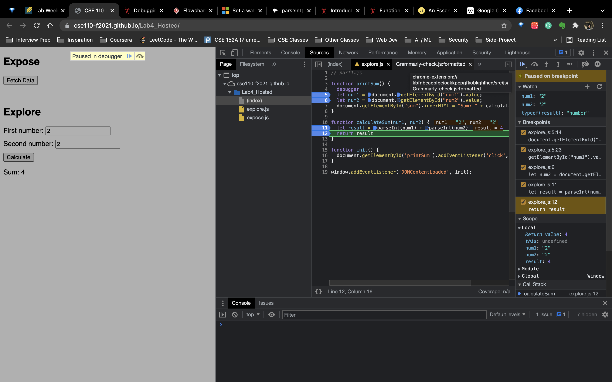

1. The bug is that `num1` and `num2` have not been changed into number type when computing `result`. Instead or performing addition, 
`let result = num1 + num2` becomes a string concatenentenation because both `num1` and `num2` are string.
2. To fix this, I use `parseInt()` to change `num1` and `num2` to number type then perform addition. 

